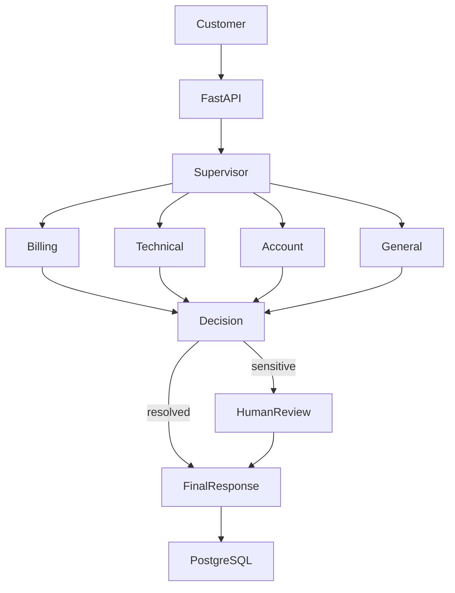
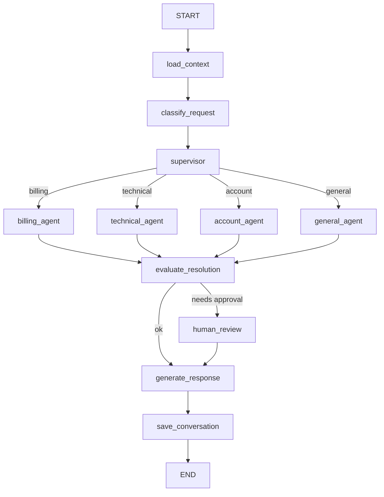

# AI Customer Support Agent

> Full setup, architecture, and testing guide: see **[DOCUMENTATION.md](./DOCUMENTATION.md)**.

Portfolio-quality **agentic customer support** platform built with **Python**, **LangChain**, **LangGraph**, **FastAPI**, and **PostgreSQL**.

A customer message such as *"I was charged twice for my subscription."* is classified, routed to a specialized agent, investigated with tools, paused for human approval when needed, then answered — with full conversation persistence and optional LangSmith tracing.

---

## Features

- Multi-agent LangGraph workflow (supervisor + billing / technical / account / general)
- Structured intent classification (`SupportIntent` Pydantic model)
- Tool-using specialized agents (no free-form SQL)
- Human-in-the-loop approvals with LangGraph `interrupt` + durable checkpoints
- Conversation memory + customer context
- Markdown knowledge base (swap-ready for vector search)
- FastAPI REST API with Pydantic schemas
- PostgreSQL via SQLAlchemy async + Alembic migrations
- LangSmith observability (optional)
- Pytest suite with mocked / offline LLM paths
- Docker Compose (API + Postgres)

---

## Architecture



### LangGraph workflow



---

## Agents

| Agent | Responsibility |
|-------|----------------|
| **Classifier** | Structured `SupportIntent` (category, priority, summary, requires_human) |
| **Supervisor** | Routes to a specialist — does **not** solve the issue |
| **Billing** | Duplicate charges, failed payments, refunds (HITL) |
| **Technical** | Knowledge-first troubleshooting; ticket escalation |
| **Account** | Password reset; email change (HITL) |
| **General** | Policy/FAQ from knowledge base; ticket if insufficient |
| **Response** | Customer-facing reply (optional LLM polish) |

---

## Tools

| Tool | Type | Notes |
|------|------|-------|
| `get_customer` / `get_subscription` / `get_account_status` / `get_customer_device` | Read | Controlled DB access |
| `get_transactions` / `get_invoice` | Read | Never invent transactions |
| `search_knowledge_base` / `get_service_status` | Read | KB + mock status |
| `create_password_reset` / `create_support_ticket` | Safe write | Audited |
| `create_refund_request` / `prepare_email_change` | Sensitive write | Creates **pending approval** only |

Sensitive writes never execute until a human approves via the API.

---

## Database

SQLAlchemy models: `Customer`, `Conversation`, `Message`, `Ticket`, `Transaction`, `Approval`, `SupportAction`.

Migrations live under `alembic/`. Demo seed data: `scripts/seed_database.py` (`CUST-001`–`003`, duplicate charges, failed payment, tickets).

---

## Human-in-the-loop

1. Agent prepares a sensitive action → `Approval` row (`pending`)
2. Graph node `human_review` calls LangGraph `interrupt`
3. API returns `status=awaiting_approval` + `approval_id`
4. `POST /api/v1/approvals/{id}/approve|reject` resumes the graph with `Command(resume=...)`
5. On approve, the orchestrator executes the real side effect (refund record / email change), then the graph generates the final reply

---

## Memory

1. **Conversation memory** — prior messages loaded into graph state
2. **Customer context** — plan, device, app version, recent tickets/transactions

---

## Setup

```bash
cd ai-customer-support
python3.12 -m venv .venv
source .venv/bin/activate
pip install -e ".[dev]"
cp .env.example .env
# Edit .env — set LLM_API_KEY for live LLM; heuristic classifier works without it
mkdir -p data
python scripts/seed_database.py
uvicorn app.main:app --reload --port 8000
```

OpenAPI docs: http://localhost:8000/docs

---

## Environment variables

| Variable | Purpose |
|----------|---------|
| `LLM_API_KEY` | Provider API key (OpenAI-compatible) |
| `LLM_MODEL` | Model id (e.g. `openai/gpt-4o-mini`) |
| `LLM_BASE_URL` | Base URL (default OpenRouter) |
| `DATABASE_URL` | Async SQLAlchemy URL |
| `LANGSMITH_TRACING` | `true` to enable tracing |
| `LANGSMITH_API_KEY` | LangSmith key |
| `LANGSMITH_PROJECT` | Project name |
| `CHECKPOINT_DB_PATH` | SQLite path for graph checkpoints |
| `KNOWLEDGE_DIR` | Path to Markdown knowledge files |

---

## Tests

```bash
pytest -v
```

Tests use SQLite + heuristic classification (no live LLM required).

---

## Docker

```bash
export LLM_API_KEY=your-key   # optional
docker compose up --build
```

API: http://localhost:8000 — Postgres on `localhost:5432`.

For Postgres schema via Alembic:

```bash
alembic upgrade head
```

---

## Example API requests

```bash
# Create conversation
curl -s -X POST http://localhost:8000/api/v1/conversations \
  -H 'Content-Type: application/json' \
  -d '{"customer_id":"CUST-001"}'

# Billing — duplicate charge
curl -s -X POST http://localhost:8000/api/v1/conversations/{id}/messages \
  -H 'Content-Type: application/json' \
  -d '{"content":"I was charged twice for my subscription."}'

# List pending approvals
curl -s http://localhost:8000/api/v1/approvals

# Approve refund
curl -s -X POST http://localhost:8000/api/v1/approvals/{approval_id}/approve \
  -H 'Content-Type: application/json' \
  -d '{"reviewer_note":"Verified duplicate"}'
```

---

## Demo scenarios

| Scenario | Customer | Expected path |
|----------|----------|---------------|
| Duplicate charge | `CUST-001` | classify→billing→tools→refund approval→HITL→response |
| Password reset | `CUST-002` | classify→account→`create_password_reset`→response |
| PDF crash | `CUST-003` | classify→technical→KB→troubleshooting / ticket |
| Undocumented | any | classify→general→insufficient KB→ticket |

---

## LangSmith

Set `LANGSMITH_TRACING=true` and `LANGSMITH_API_KEY`. Traces cover graph nodes, tool calls, and errors. The app runs normally when tracing is disabled.

Each support turn is recorded as a root run named **`support_turn`** (resume path: **`support_turn_resume`**) with:

- **Tags**: `support_agent`, `env:*`, `version:*`, plus outcome tags like `agent:billing`, `hitl`, `has_ticket`
- **Metadata**: `customer_id`, `conversation_id`, `thread_id`, `llm_model`, `agent_version`, truncated message preview (emails masked)

Bump `AGENT_VERSION` in `.env` when you change agent behavior so experiments stay comparable.

---

## Project layout

```
ai-customer-support/
├── app/
│   ├── agents/          # classifier, supervisor, specialists, response
│   ├── api/routes/      # FastAPI endpoints
│   ├── graph/           # LangGraph state, nodes, routing, workflow
│   ├── tools/           # LangChain tools + knowledge base
│   ├── models/          # SQLAlchemy
│   ├── schemas/         # Pydantic
│   ├── services/        # Business logic (no Fat Controllers)
│   ├── memory/          # Conversation + customer memory
│   └── middleware/      # Logging + tool authorization
├── knowledge/           # Markdown KB
├── tests/
├── scripts/seed_database.py
├── Dockerfile
└── docker-compose.yml
```

---

## Concepts demonstrated

```
LangChain → models, prompts, tools, structured output
LangGraph → state, nodes, conditional edges, checkpoints, HITL
Deep agents → planning via supervisor delegation, specialized agents, context/memory
```

---

## Future improvements

- Vector / hybrid knowledge retrieval
- Real payment-provider webhooks
- Streaming token responses over SSE
- Multi-turn clarification nodes
- Role-based auth for the approval console
- Postgres checkpointer instead of SQLite for HITL at scale
